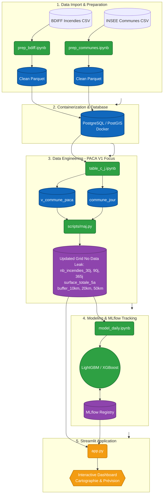

# Incendies
## Wildfire Risk Prediction in France

### Goal :
Develop an end-to-end predictive intelligence system to estimate the daily forest fire risk for French municipalities<br> For the V1 prototype, the ambition has been adjusted to focus exclusively on
- the PACA region
- from 2016 onwards<br>

Ensuring robust performance on a daily spatio-temporal grid


## Data import

First thing's first, import the datasets :

- Fires - [BDIFF](https://bdiff.agriculture.gouv.fr/incendies)
- Cities - [Liste des communes de France 2026](https://www.data.gouv.fr/datasets/liste-des-communes-de-france-code-insee-codes-postaux-epci-population-superficie-62-indicateurs?resource_id=c63fd0b1-7987-46f6-b779-8b3ed889090c)


## Architecture & Data Flow Workflow
The data pipeline follows a `raw` > `clean` > `processed` structure<br>
 orchestrated via a PostgreSQL/PostGIS database and tracked with MLflow].


### 1. Data Import from CSV to MySQL & Cleaning
*   **`notebooks/csv2mysql/incendies-database.ipynb`**
    *   Incendies **Input** - Official BDIFF datasets (`data/bdiff_data_raw/Incendies*.csv`) : https://bdiff.agriculture.gouv.fr/incendies
    *   Commues **Input** - INSEE municipalities list (`data/geo_data_raw/communes-france-2026.csv`) : https://www.data.gouv.fr/datasets/liste-des-communes-de-france-code-insee-codes-postaux-epci-population-superficie-62-indicateurs
    *   **Details**: 
        *   import from csv to MySQL MyISAM tmp tables (tmp_incendie and tmp_commune) + indexes creation
        *   Create tables linked to commune : localisation, region, departement, commune + cleaning then data + indexes
        *   Create tables linked to incendie : precision_surface, type_peuplement, nature + cleaning then data + indexes
        *   Create tables linked to cluster : type_cluster, cluster + data

### 2. Dump MySQL and Postgres Database Creation (legacy): 
*   MySQL Dump : ddl + data
    *   **Input**: MySQL
        *   SQL code transformation (MySQL -> Postgres)
        *   Creating a Docker Compose file for setting up two linked services (PostGIS + Streamlit), along with well-structured initialization files within an init directory (01-schema.sql, 02-tables.sql, 03-data.sql)
    *   **Output**: Containerized `postgis:17-3.5` database with the `incendies` schema and imported tables.

### 3. Geographic clustering for all commune (unused): 
*   **`notebooks/dbscan/dbscan_final.ipynb`**
    *   Addition of the PostGIS extension
    *   Use of the DBSCAN algorithm to determine the optimal values for eps and min_samples using silhouette_score and davies_bouldin_score metrics
    * Visualization of clusters for each region
    * insertion of generated clusters (by location / by municipalities with fires) into the cluster table (with tracking in an experiment table: no MLflow implemented at this stage)

### 4. Database Re-Initialization : Spatio-Temporal Grid & Feature Engineering
*   **`notebooks/xgboost/table_c_j past.ipynb`**
    *   Creation of the commune_jour table (feature table) : Base daily grid `commune_jour` (PACA region, 2016-2025)
    *   Database export: 
        *   Schema creation : `01-schema.sql`
        *   DDL creation : `02-ddl.sql`
        *   data insert : `03-data.sql`
    *   Notebook-based update of feature fields: 
        *   target has_fire, 
        *   features (Note: Strictly uses past data to prevent data leakage*)
            *   `nb_incendies_30j`, `nb_incendies_90j`, `nb_incendies_365j`
            *   `surface_totale_5a`, 
            *   `buffer_10km`, `buffer_20km`, `buffer_50km` + materialized views (`mv_communes_voisines_10km`, `mv_communes_voisines_20km`, `mv_communes_voisines_50km`)

### 5a. Machine Learning & MLflow Tracking : branch v1_b
*   **`notebooks/model_daily.ipynb`**
    *   **Input**: `commune_jour` and `v_commune_paca` views from the database
    *   **Output**: Trained ML models (LightGBM, XGBoost) and evaluation metrics
    *   **Details**: Uses a strict spatio-temporal split (Train: 2016-2022, Val: 2023, Test: 2024+) and 1:10 downsampling for the negative class during Grid Search All runs are logged locally in `mlflow.db` under the `Prediction_Risque_Incendies` experiment

### 5a. Application Streamlit : branch v1_b
    *   Application (Front-End) : `app/streamlit/app.py`**
    *   **Input**: PostgreSQL database (Historical Map) & MLflow Model Registry (Prediction).
    *   **Output**: Interactive Streamlit Dashboard exposing fire risk predictions (Tab 2).

### 5b. Machine Learning & MLflow Tracking : branch v1_p + main
*   **`notebooks/xgboost/xgboost past.ipynb`**
    *   **Input**: `commune_jour` and `v_commune_paca` views from the database
        *   Features :
            *   Spatial / Densité / Relief : `densite`, `superficie_hectare`, `altitude_moyenne`, `amplitude_altitude`
            *   Saisonnalité & Temporel : `jour_semaine`, `sin_jour_annee`, `cos_jour_annee`, `saison_automne`, `saison_ete`, `saison_hiver`,`saison_printemps`
            *   Historique & Buffers : `nb_incendies_30j`, `nb_incendies_90j`, `nb_incendies_365j`, `surface_totale_5a`, `buffer_10km`, `buffer_20km`, `buffer_50km`

# Scores : `score_histo`, `score_topo`
    *   **Output**: Trained ML models (XGBoost) and evaluation metrics
    *   **Details**: 
        *   

### 5b. Application Streamlit : branch v1_p + main
    *   Application (Front-End) : `app/streamlit/app.py`**
    *   Interactive Streamlit Dashboard exposing fire risk predictions (Tab 2).

## MLflow Tracking
The MLflow UI is accessible at [http://127.0.0.1:5000](http://127.0.0.1:5000).
The `Prediction_Risque_Incendies` experiment logs all model parameters, dataset shapes, and metrics (such as `pr_auc_validation` and `roc_auc_test_final`).

## Future Perspectives
*   **Microservices Architecture**: Decouple the Streamlit frontend from the backend by deploying a FastAPI + Uvicorn prediction API for production scalability.
*   **Meteorological Data**: Integrate external climate data (wind, drought indices) to overcome the current predictive ceiling (PR-AUC limitations) and capture immediate fire triggers


-----
-----
-----
-----


-----
-----
-----
-----

## Data prep

### `prep_bdiff.ipynb` - Fires list

Preliminary analysis and data cleaning of [BDIFF](https://bdiff.agriculture.gouv.fr/incendies)

**input** : DATA_RAW_DIR    (/data/bdiff_data_raw/)<br>
**output** : DATA_CLEAN_DIR (/data/bdiff_data_clean/)

---


### `prep_communes.ipynb` -Cities list (without polygones)

Preliminary analysis and data cleaning of [Liste des communes de France 2026](https://www.data.gouv.fr/datasets/liste-des-communes-de-france-code-insee-codes-postaux-epci-population-superficie-62-indicateurs)

[direct download](https://www.data.gouv.fr/datasets/liste-des-communes-de-france-code-insee-codes-postaux-epci-population-superficie-62-indicateurs?resource_id=c63fd0b1-7987-46f6-b779-8b3ed889090c)


**input** : GEO_DATA_RAW_DIR    (/data/geo_data_raw/)<br>
**output** : GEO_DATA_CLEAN_DIR (/data/geo_data_clean/)

---

### Unused but useful data (with polygones)

[Liste des communes de France 2026 ... au format geojson](https://www.data.gouv.fr/datasets/liste-des-communes-de-france-code-insee-codes-postaux-epci-population-superficie-62-indicateurs?resource_id=d498e08d-8396-48ec-862e-867ac791bed4)

[direct download](https://www.data.gouv.fr/datasets/liste-des-communes-de-france-code-insee-codes-postaux-epci-population-superficie-62-indicateurs?resource_id=d498e08d-8396-48ec-862e-867ac791bed4)


## Analysis and feature engineering

### `eda.ipynb` - Analyse exploratoire

Descriptive analysis of fires data after data cleaning :<br>
- annual evolution
- monthly saisonality
- burnt surfaces distribution
- working versus holiday period comparison
- cartes géographiques et
- cartes d'intensité pondérées par la surface brûlée.

**Input** : `data/bdiff_data_clean/incendies.parquet`,
`data/geo_data_clean/communes_metropole_corse.parquet` et
`data/spatio_temp/df_spatio_temp.parquet`.<br>
**Output** : interactive map, graphs, tables...

### `feat_eng.ipynb` - features engineering and modelization

**Creation of features:**
- spatio-temporal city/day level aggregation grid `city x day`
- spatial cyclic and temporal contagion related features


**Postponed feature ideas :**
- gliding temporal windows
- risk scores computed from previous months
- spatial contagion indices within 30 km.


`commune_jour` table update (after import)

**Input** : the cleaned dataset from fires and cities dataprep<br>

**Outputs** :
- monthly :`data/data_processed/incendies_features_v2.parquet` andr `incendies_features_v2.metadata.json`

- **Sortie historique** : `data/spatio_temp/df_spatio_temp.parquet`.


---
---
---

## Target Definition

La cible principale est `target_occurrence` : `1` si au moins un incendie est
observé dans une commune pendant un mois, `0` sinon. Le dataset contient aussi
`nb_incendies`, `surface_brulee_ha` et `target_log_surface` pour les analyses et
extensions de modélisation.

## DataBase creation


## Modelisation

The split dates sont définies dans la cellule 3 de
[notebooks/modeling.ipynb](notebooks/modeling.ipynb) :

- Train : 2016–2022 inclus
- Validation : 2023
- Test final hors temps : 2024 et années suivantes
- Grid Search sur un sous-échantillon stratifié du train, avec ratio maximal de
	10 négatifs pour 1 positif
- Réentraînement final sur l'ensemble du train

## Workflow




##### 1 : Data Preparation & Architecture Base de Données
Nettoyage BDIFF & INSEE :
standardisé les noms de colonnes et optimisé l'empreinte mémoire avec des types Int32/Float64 compatibles PostgreSQL.

La bonne pratique de conserver les NaN pour la répartition des surfaces brûlées (forêt, maquis, etc.) a permis de ne pas fausser les données avec des zéros artificiels.

Exclusion géographique : Le filtrage des départements d'Outre-mer a permis de concentrer l'analyse sur la métropole et la Corse.

##### 2 : Data Engineering (Feature Engineering)
Grille Spatio-Temporelle : L'approche par produit cartésien (Commune × Année × Mois) est la seule méthode valide pour générer les classes négatives (les jours sans feux).

Zéro Data Leakage : les variables historiques glissantes (ex: cumuls sur 12 mois) et l'indice de contagion spatiale (voisinage de 30 km calculé via cKDTree) utilisent tous un décalage strict dans le temps (shift(1)).

Le modèle ne regarde que le passé.

Variables calendaires : L'ajout de la saisonnalité (sin/cos) et de l'impact de l'activité humaine (vacances, week-ends) vient compenser partiellement le manque de météo.

##### 3 : Data Analyse (EDA)
Le croisement des données a confirmé le déséquilibre extrême (1 jour avec feu pour plusieurs dizaines de jours normaux).

L'utilisation de cartes interactives (Heatmaps Folium) a permis de repérer les hotspots méditerranéens.

##### 4 : Modélisation & Tracking MLflow
Séparation temporelle stricte :

L'utilisation de l'historique jusqu'en 2022 pour l'entraînement

2023 pour la validation (Grid Search)

2024-2025 pour le test final hors-temps

garantit une évaluation non biaisée.

Sous-échantillonnage : Le ratio 1:10 appliqué sur le jeu d'entraînement pour le Grid Search a permis d'accélérer l'optimisation tout en forçant le modèle à voir la classe minoritaire.

## MLflow tracking tool consultation

The project uses a containerized Postgres Database `mlflow.db` to track the machine learning process.<br>

TheMLFlow UI is acessible with a internet browser at [http://127.0.0.1:5000](http://127.0.0.1:5000)


Within the experiment `Prediction_Risque_Incendies`, one can access to  :

- models parameters
- dataset
- `pr_auc_validation` and `roc_auc_validation` metrics
- models runs (`grid_LightGBM` and `grid_XGBoost`)
- datasets hash
- train size

Pour arrêter l'interface, utiliser `Ctrl+C` dans le terminal qui l'exécute.

## Project structure

```text
data/            raw, cleaned and processed data
init/            database initialization scripts
notebooks/       Data prep, EDA, feature engineering and modelisation
src/             Configurationand constants
utils/           cleaning, analyse and feature engineering functions
app/streamlit/   Application
```


## Perspective d'amélioration
architecture cible idéale (Microservices) :<br>
FastAPI + Uvicorn (Production)<br>
Séparer le Front (Streamlit) du Back (FastAPI) permet de faire scaler l'API de prédiction indépendamment si des milliers d'utilisateurs se connectent
